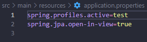
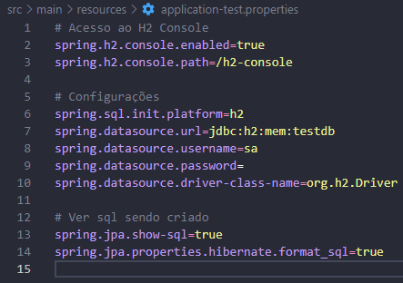
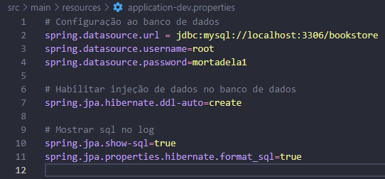
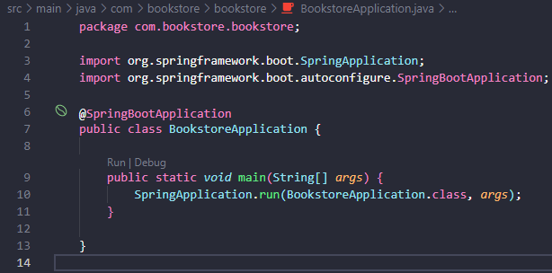
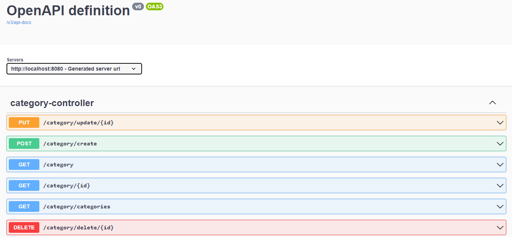

# Book Store Api

## Descrição do Projeto

Projeto consiste na criação de uma api para uma biblioteca, onde os livros serão cadastrados, atualizados e deletados.

Cada livro terá uma categoria associada, onde para cadastrar um livro deverá preexistir uma categoria para o mesmo.

Após excutado o projeto localmente, para ver a documentação acesse: [swagger](http://localhost:8080/swagger-ui/index.html#/)

## End-Points do Projeto

### Para Livros
- [GET] consultar todos os livros: {url}/book/books

- [GET] consultar 1 livro especifico, passar id por parametro na requisição: {url}/book/{id}

- [GET] consultar livros por categoria, passar id de categoria query ex: {url}/book?category=1

- [POST] criar Livro, passar id de categoria no corpo da requisição: {url}/book/create
``` Json Body
{
    "title": "type string",
    "author": "type string",
    "text": "type string",
    "categoryId": "type long",
}
```

- [PutORPatch] atualizar Livro, passar id do livro por parametro da requisição: {url}/book/update/{id}
``` Json Body
{
    "title": "type string",
    "author": "type string",
    "text": "type string",
}
```

- [DELETE] deletar Livro, passar id do livro por parametro da requisição: {url}/book/delete/{id}

### Para Categoria

- [GET] consultar todas as categorias: {url}/category/categories

- [GET] consultar 1 categoria especifica, passar id por parametro na requisição: {url}/category/{id}

- [GET] consultar categoria, sem retornar lista de livros: {url}/category

- [POST] criar Categoria: {url}/category/create
``` Json Body
{
    "name": "type string",
    "description": "type string",
}
```

- [Put] atualizar Categoria, passar id da Categoria parametro da requisição: {url}/category/update/{id}
``` Json Body
{
    "name": "type string",
    "description": "type string",
}
```

- [DELETE] deletar Categoria, passar id da categoria parametro da requisição: {url}/category/delete/{id}

## Descrição da Api
### Executar Api localmente:
- Para clonar o projeto: git clone https://github.com/TaylanTorres09/book-store-api.git
- Para Executar o projeto precisasse:
    - Java [JDK](https://www.oracle.com/java/technologies/downloads/#java17). Este projeto está usando a versão 17.
    - Para perfil de Teste, Banco [H2](https://www.h2database.com/html/main.html) utilizado em memória, coloquei neste pois é um banco de fácil configuração e utilização.
    - Para perfil de Produção, Banco [MySQL](https://www.mysql.com/products/workbench/).

- Extensões do vscode utilizadas:
    - [Debugger for Java](https://marketplace.visualstudio.com/items?itemName=redhat.java)
    - [Spring Boot Extension Pack](https://marketplace.visualstudio.com/items?itemName=Pivotal.vscode-boot-dev-pack)

- Para seleção do perfil **test** para perfil de teste e **dev** para perfil de desenvolvimento.


- Configuração do banco de dados de Teste.



- Configuração do banco de dados de Dev.



- Na pasta src/main, execute o arquivo BookstoreApplication.java



- Após executado o projeto acesse [swagger](http://localhost:8080/swagger-ui/index.html#/) para ver documentação.



- Para testar a api você pode utilizar ferramentas de client como:
    - [Postman](https://www.postman.com/)
    - [Insomnia](https://insomnia.rest/download)
    - Extensão do VsCode [Thunder Client](https://marketplace.visualstudio.com/items?itemName=rangav.vscode-thunder-client)
    - Ou outra de sua preferência.

## Próximos Passos
- Fazer interfaces no front-end.
- Implementar Cobertura de testes.
## Autor
<a href="https://www.linkedin.com/in/taylan-torres" target="_blank"></a> 